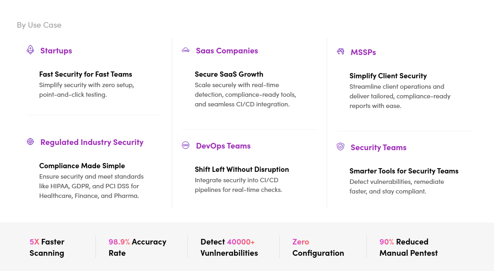

  

# ✨ ZeroThreat AI

In a landscape where cyber threats evolve daily, **ZeroThreat** emerges as your steadfast protector, delivering state-of-the-art security solutions for web applications and APIs. Detect vulnerabilities early, remediate them swiftly, and fortify your digital assets with confidence.

ZeroThreat is a cloud-based security platform designed for simplicity and power. With **point-and-click ease**, **zero setup**, and **rapid scans** (0.5–2 hours), it identifies critical issues like OWASP Top 10 vulnerabilities and sensitive data exposures empowering teams to secure their applications effortlessly.

  

## 🚀 Why Choose ZeroThreat?

- **Effortless Usability**: Start scanning in minutes no complex setup required.
- **Lightning-Fast Scans**: Comprehensive results in just 0.5–2 hours.
- **Broad Coverage**: From OWASP Top 10 to sensitive data leaks, we’ve got you covered.
- **Team-Friendly**: Role-based access and collaboration tools built-in.
- **Top-Notch Support**: Detailed documentation and responsive assistance at your fingertips.

---

## 🛡️ Key Features

### Comprehensive Security Scanning

Uncover vulnerabilities with precision:

- Web Application Vulnerability Detection
- API Security Assessments
- SSL/TLS Certificate Analysis
- Server Port Scanning
- Mail Server Configuration Checks
- Compliance Verification

Our cutting-edge engine ensures thorough, reliable assessments every time.

### Advanced Authentication Support

Test like a real user:

- Authenticated Scan Capabilities
- Login Sequence Recording
- Multi-Factor Authentication (MFA) Support
- Custom Header Management

Simulate authentic scenarios without sacrificing usability.

### Organization Management

Streamline team efforts:

- Multi-Organization Support
- Role-Based Access Control
- Team Collaboration Features
- User Management

Equip your team with secure, organized access to critical data.

### Scan Management

Control your security process:

- Scheduled Scans
- Detailed Scan Reports
- Vulnerability Prioritization
- Custom Scan Configurations

Tailor scans to your needs and stay ahead of threats.

### Target Management

Manage assets efficiently:

- **Target Verification**: Secure domain ownership via DNS TXT or HTML file upload.
- **Target Configuration**: Customize headers, authentication, scope, and rules.

Keep your scans focused and secure.

### Scan Results & Reporting

Turn insights into action:

- **Comprehensive Reports**: Detailed vulnerability breakdowns, risk levels, and remediation steps.
- **Result Sharing**: Exportable PDFs, team collaboration, and historical tracking.

Make informed decisions with clear, actionable data.

---

## 🎯 Getting Started with ZeroThreat

Ready to secure your applications? Here’s how to begin:

1. **Create an Account**

   - Head to [zerothreat.ai](https://zerothreat.ai)
   - Sign up and select a plan tailored to your needs

2. **Add Your First Target**

   - Go to the Targets section
   - Enter your web app or API URL
   - Verify ownership for security

3. **Run Your First Scan**

   - Pick your target and scan type
   - Set your parameters
   - Launch the scan and relax

4. **Review Results**
   - Explore detailed reports
   - Prioritize fixes
   - Track your progress

---

## 💡 Who Benefits from ZeroThreat?

## 

## 📚 Documentation & Resources

Dive deeper with our comprehensive resources:

- **Quick Start Guides**
- **Feature Documentation**
- **Best Practices**
- **Troubleshooting Tips**
- **FAQ**

---

## 🤝 Support & Contact

We’re here for you:

- **Technical Support**: Reach us via our portal
- **Email**: [hello@zerothreat.ai](mailto:hello@zerothreat.ai)
- **Website**: [zerothreat.ai](https://zerothreat.ai)

---

## **Ready to Take Control of Your Security?**

Start your free trial at [zerothreat.ai](https://zerothreat.ai) and experience how ZeroThreat transforms vulnerability assessment.
